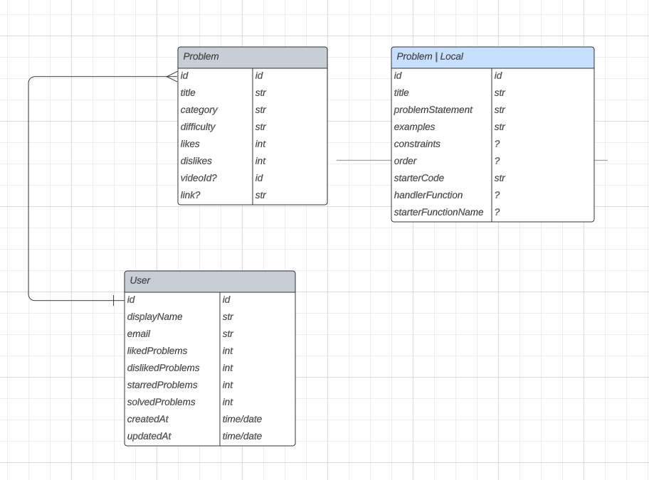

# Technologies Used

[React](https://react.dev/)

[Typescript](https://www.typescriptlang.org/docs/handbook/react.html)

[Recoil JS](https://recoiljs.org/)

[Tailwind CSS](https://tailwindcss.com/)

[Firebase](https://firebase.google.com/)

[React Firebase Hooks](https://github.com/CSFrequency/react-firebase-hooks/tree/master/auth)

[Split.js](https://split.js.org/)

# Tailwind CSS Color Theme
https://v1.tailwindcss.com/docs/customizing-colors

Temporary Solution to adding problems to firestore: `src/pages/index.tsx`

## Next Steps:

- [x] Firebase Setup
- [x] Signup Functionality
- [x] Login Functionality
- [X] Auth Page Route Guard
- [X] Home Page UI

- [x] Logout Functionality
- [x] Reset Password Functionality
- [x] React Toastify
- [x] Image Optimizations
- [x] Creating PID page
- [x] Updating Topbar

- [x] Timer Component
- [x] Workspace component
- [x] Splitting the page
- [x] Problem description
- [x] Preferences Navigation

- [x] Create a code editor
- [x] Writing test cases for the UI

- [x] Use SSG (Static Site Generation) for `[pid].tsx`
- [x] Updated test cases UI 
- [x] Adding problems to firestore through a temporary form

-[x] Loading wheel during fetch...
-[x] Fetch problems from firebase DB

