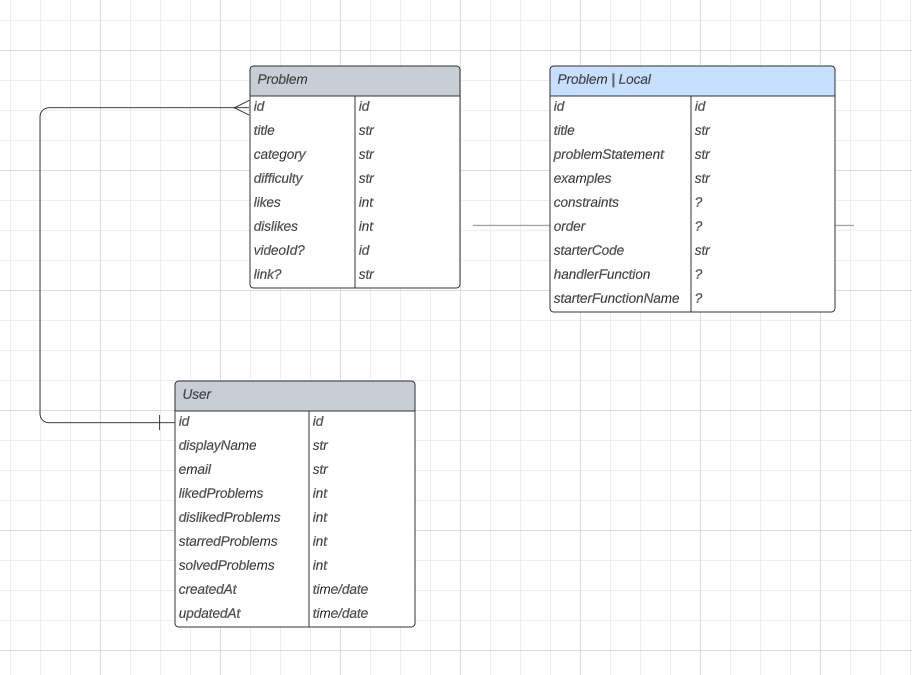
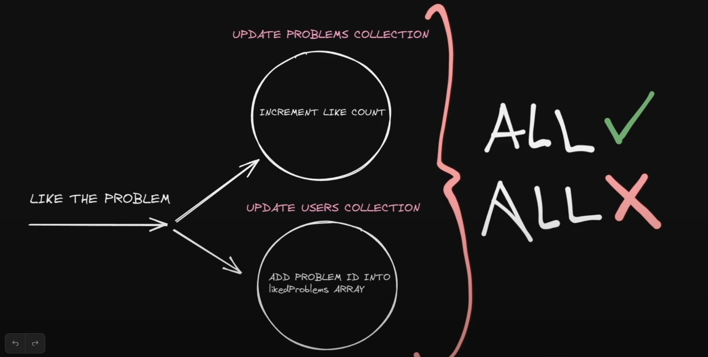

# Technologies Used

[React](https://react.dev/)

[Typescript](https://www.typescriptlang.org/docs/handbook/react.html)

[Recoil JS](https://recoiljs.org/)

[Tailwind CSS](https://tailwindcss.com/)

[Firebase](https://firebase.google.com/)

[React Firebase Hooks](https://github.com/CSFrequency/react-firebase-hooks/tree/master/auth)

[Split.js](https://split.js.org/)

# Tailwind CSS Color Theme
https://v1.tailwindcss.com/docs/customizing-colors

Temporary Solution to adding problems to firestore: `src/pages/index.tsx`

## Next Steps:

- [x] Build out dislike functionality 
- [x] Build out favorites (star) functionality
- [] Build out next && previous problem links

